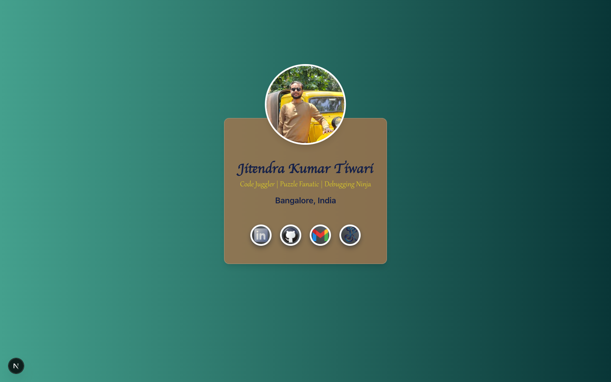
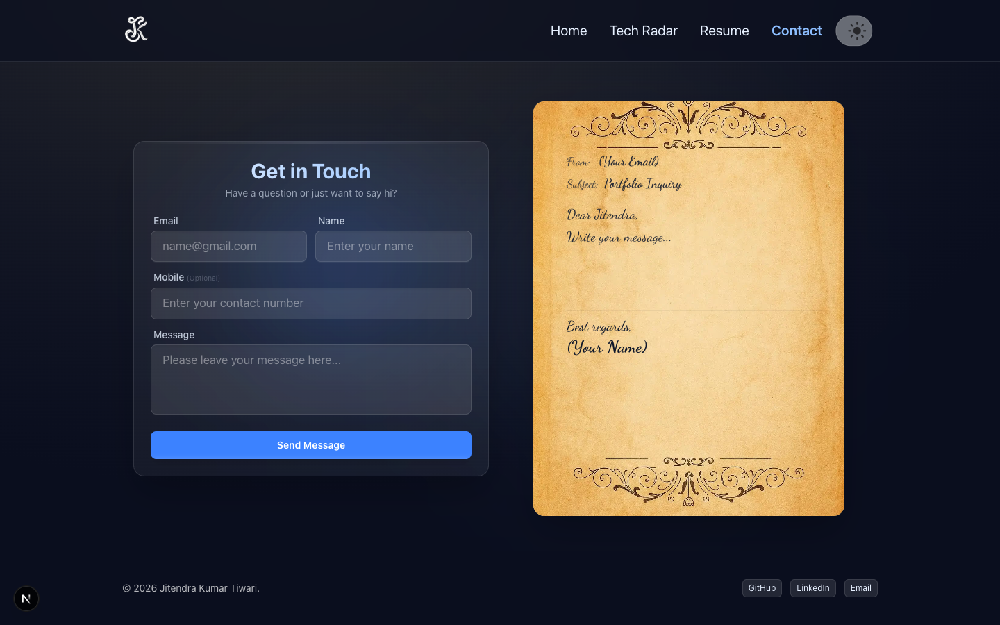

# Jitendra Portfolio

A modern, responsive developer portfolio built with Next.js 16, TypeScript, and TailwindCSS.
It showcases projects, work experience, tech skills, blogs, and supports theme switching with a polished UI featuring stunning animations.

<hr/>

## 🚀 Features

- **Responsive Design**: Mobile-first UI with adaptive layouts.
- **Sections**:
  - Landing page with animated name card and enter transition.
  - Home with hero section, skill typing animation, and company solar system orbit.
  - Personal Projects with 3D hover cards.
  - Blogs with images, tags, and metadata.
  - Tech Radar displaying skills across different technology categories.
  - Contact page with elegant parchment-style form.
  - Resume (view inline on desktop, download on mobile).
- **Company Solar System**: Animated orbit display of companies worked with.
- **Theme Switcher**:
  - Desktop inline dropdown.
  - Mobile floating action button (FAB).
  - Live preview on hover + persistent theme with localStorage.
- **Collapsible Navbar**:
  - Desktop navigation links.
  - Mobile hamburger menu with slide-over panel.
- **SEO-friendly**:
  - Next.js Metadata API used.
  - Optimized images with next/image.
- **Modern Styling**: TailwindCSS with custom themes (light, dark).
- **Smooth Animations**: Framer Motion powered transitions and micro-interactions.

<hr/>

## 🛠️ Tech Stack

- **Framework**: Next.js 16 (Turbopack)
- **Language**: TypeScript
- **Styling**: TailwindCSS
- **Animations**: Framer Motion
- **Icons/Images**: Next.js Image Optimization

<hr/>

## 📂 Project Structure

```
├── app/
│   ├── page.tsx           # Landing page
│   ├── home/              # Home page with hero, projects, solar system
│   ├── blogs/             # Blogs page
│   ├── tech-radar/        # Tech Radar page
│   ├── contact/           # Contact page with parchment form
│   ├── resume/            # Resume page (PDF view/download)
│   ├── layout.tsx         # Root layout with theme init
│   ├── globals.css        # Tailwind + global styles
│
├── components/
│   ├── Header.tsx         # Navbar + mobile hamburger
│   ├── Footer.tsx         # Footer with socials
│   ├── LandingCard.tsx    # Animated landing card
│   ├── SolarSystem.tsx    # Company orbit animation
│   ├── CompanyOrbit.tsx   # Orbit component for companies
│   ├── ProjectCard.tsx    # 3D project cards
│   ├── ThemeSwitcher.tsx  # Theme dropdown + FAB
│   ├── TechPill.tsx       # Tech radar pill display
│   ├── VerticalPills.tsx  # Vertical skills display
│   ├── ContactParchment.tsx # Contact form component
│   ├── MouseGradient.tsx  # Mouse-following gradient effect
│   ├── ResumeClient.tsx   # Resume viewer client component
│   ├── SmartDownloadButton.tsx # Smart download for resume
│
├── data/
│   ├── companies.json     # Companies worked with
│   ├── personal-projects.json
│   ├── blogs.json
│   ├── experience.json
│   ├── tech-radar.json
│   ├── skills-matrix.json
│   ├── testimonials.json
│
├── public/
│   ├── logos/             # Company + personal logos
│   ├── blogs/             # Blog cover images
│   ├── tech/              # Technology icons
│   ├── screenshots/       # App screenshots
│   └── jitendra_resume.pdf
│
├── hooks/
│   └── ...                # Custom React hooks
│
├── package.json
└── README.md
```

<hr/>

## ⚙️ Setup & Development

1. Clone the repo:

```bash
git clone https://github.com/jkjitendra/jitendra-portfolio.git
cd jitendra-portfolio
```

2. Install dependencies:

```bash
npm install
```

3. Run the development server:

```bash
npm run dev
```

4. Open [http://localhost:3000](http://localhost:3000) to view in the browser.

<hr/>

## 🎨 Theming

Themes are defined in globals.css using CSS variables:

- light
- dark

Switch themes using the ThemeSwitcher (desktop dropdown or mobile FAB).
The ThemeSwitcher component handles theme selection and persistence using localStorage.

<hr/>

## 📸 Screenshots

### Landing Page


### Home Page


<!-- ### Blogs Page
 -->

### Tech Radar Page


### Contact Page


<hr/>

## 🌐 Live Demo

Check out the live portfolio here: [jkjitendra.in](https://www.jkjitendra.in)

<hr/>

## 🛠 export-project.js — Project Export Utility

This Node.js script automates the process of exporting the entire project source code into a single, shareable Markdown file (project-portfolio.md).

### Purpose

- To generate a text-based portfolio snapshot of the project for documentation, archiving, or sharing with recruiters.
- It consolidates important source files (code, configs, data, components) into one readable Markdown file, excluding build artifacts and binary assets.

### Usage

Run the script from your project root:

```bash
  node scripts/export-project.js
```

<hr/>

## 📄 License

MIT License © 2025 Jitendra Kumar Tiwari
