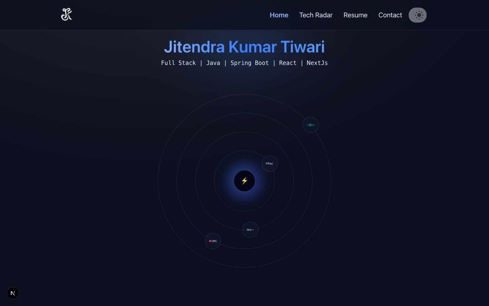
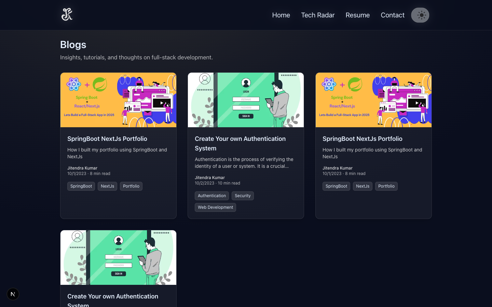
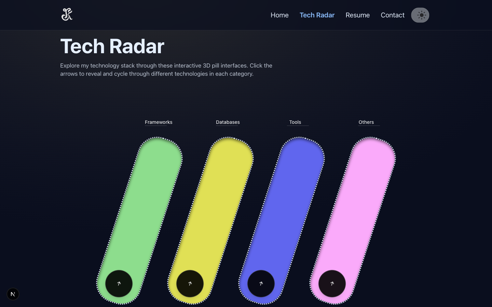

# Jitendra Portfolio

A modern, responsive developer portfolio built with Next.js 15, TypeScript, and TailwindCSS.
It showcases projects, work experience, case studies, testimonials, blogs, and supports theme switching with a polished UI.

<hr/>

## 🚀 Features

- **Responsive Design**: Mobile-first UI with adaptive layouts.
- **Sections**:
  - Hero with name, tagline, and company carousel.
  - Work Experience & Personal Projects.
  - Case Studies.
  - Blogs with images, tags, and metadata.
  - Resume (view inline on desktop, download on mobile).
  - Testimonials & Performance improvements.
- **Company Carousel**: Auto-scrolling slider with partner logos.
- **Theme Switcher**:
  - Desktop inline dropdown.
  - Mobile floating action button (FAB).
  - Live preview on hover + persistent theme with localStorage.
- **Collapsible Navbar**:
  - Desktop navigation links.
  - Mobile hamburger menu with slide-over panel.
- **SEO-friendly**:
  - Next.js Metadata API used.
  - Optimized images with next/image.
- **Modern Styling**: TailwindCSS with custom themes (emerald, amethyst, sapphire, solar, mono).

<hr/>

## 🛠️ Tech Stack

- **Framework**: Next.js 15
- **Language**: TypeScript
- **Styling**: TailwindCSS
- **Icons/Images**: Next.js Image Optimization

<hr/>

## 📂 Project Structure

```
├── app/
│   ├── page.tsx           # Home page
│   ├── layout.tsx         # Root layout with theme init
│   ├── globals.css        # Tailwind + global styles
│   ├── projects/          # Projects page
│   ├── blogs/             # Blogs page
│   ├── resume/            # Resume page (PDF view/download)
│   ├── tech-radar/        # Tech Radar page
│   ├── testimonials/      # Testimonials page
│   ├── performance/       # Performance page
│
├── components/
│   ├── Header.tsx         # Navbar + mobile hamburger
│   ├── Footer.tsx         # Footer with socials
│   ├── CompanyCarousel.tsx# Partner logos slider
│   ├── ThemeSwitcher.tsx  # Theme dropdown + FAB
│   ├── TestimonialMarquee.tsx
│   ├── SimpleLine.tsx     # Line chart for performance
│
├── data/
│   ├── companies.json     # Companies worked with
│   ├── personal-projects.json
│   ├── case-studies.json
│   ├── blogs.json
│   ├── performance.json
│   ├── testimonials.json
│
├── public/
│   ├── logos/             # Company + personal logos
│   ├── blogs/             # Blog cover images
│   ├── authors/           # Author images
│   └── jitendra_resume.pdf
│
├── package.json
└── README.md
```

<hr/>

## ⚙️ Setup & Development

1. Clone the repo:

```bash
git clone https://github.com/jkjitendra/jitendra-portfolio.git
cd jitendra-portfolio
```

2. Install dependencies:

```bash
npm install
```

3. Run the development server:

```bash
npm run dev
```

4. Open [http://localhost:3000](http://localhost:3000) to view in the browser.

<hr/>

## 🎨 Theming

Themes are defined in globals.css using CSS variables:

- emerald  🌿
- light    ⚪
- amethyst 💜
- sapphire 🔷
- solar    ☀️

Switch themes using the ThemeSwitcher (desktop dropdown or mobile FAB).
The ThemeSwitcher component handles theme selection and persistence using localStorage.

<hr/>

## 📸 Screenshots







<hr/>

## 🌐 Live Demo

Check out the live portfolio here: [jkjitendra.in](https://www.jkjitendra.in)

<hr/>

## 🛠 export-project.js — Project Export Utility

This Node.js script automates the process of exporting the entire project source code into a single, shareable Markdown file (project-portfolio.md).

### Purpose
- To generate a text-based portfolio snapshot of the project for documentation, archiving, or sharing with recruiters.
- It consolidates important source files (code, configs, data, components) into one readable Markdown file, excluding build artifacts and binary assets.

### Usage
Run the script from your project root:
```bash
  node scripts/export-project.js
```

<hr/>

## 📄 License

MIT License © 2025 Jitendra Kumar Tiwari
